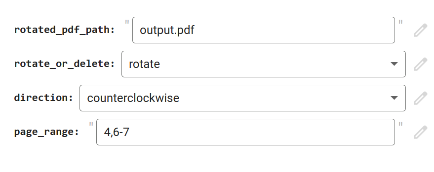

# pdf-utilities

## Purpose

From time to time I need to manipulate PDF files for personal use: split, merge, rotate, compress.  
It's not something that warrants the use of specialized heavy duty software, but I also don't want to use free third-party online tools because of the concerns about privacy, security, and added watermarks.  
A lot of stuff can be done with Python, so I used to run small scripts in the Python IDE on my desktop.  

I currently explore using Google Colab for this:  
- I can use Python  
- It's free  
- There's runtime with enough RAM and disk storage  
- I can share the notebook so that others could easily use it too  
- There's a nice interface for input parameters  

  

  
I want to collect here useful scripts for editing PDFs in Colab.

### [Copy PDFs](https://github.com/olga-terekhova/pdf-utilities/blob/main/CopyPDF.ipynb)  
Copies a PDF file into a new PDF file according to a user-defined list of selected pages.  
May be used to extract, drop, repeat, reorder pages.   
(1 PDF -> 1 PDF)  

### [Merge PDFs](https://github.com/olga-terekhova/pdf-utilities/blob/main/MergePDFs.ipynb)  
Merges several PDFs into one PDF file (input files are sorted in an alphabetical order for merging).  
(Many PDFs -> 1 PDF)  

### [Rotate PDF](https://github.com/olga-terekhova/pdf-utilities/blob/main/RotatePDF.ipynb)
Rotates selected pages in a PDF file in a chosen direction.  
(1 PDF -> 1 PDF)  

### [Split PDFs](https://github.com/olga-terekhova/pdf-utilities/blob/main/SplitPDF.ipynb)  
Splits a PDF file into several output PDF files.  
(1 PDF -> Many PDFs)  

### [Generate PDF Thumbnails](https://github.com/olga-terekhova/pdf-utilities/blob/main/Generate_PDF_thumbnails.ipynb)
Generates a new PDF with a grid of thumbnails for each page of the input PDF.  
(1 PDF -> 1 PDF)

### [Pdf to Spreads](https://github.com/olga-terekhova/pdf-utilities/blob/main/Pdf_to_Spreads.ipynb)  
Converts a PDF file with one page per spread (optimized for printing) into a PDF file with two pages per spread (optimized for reading on a widescreen). 

## How to use

Open in Google Colab, create a copy, and follow instructions in the notebook. 
